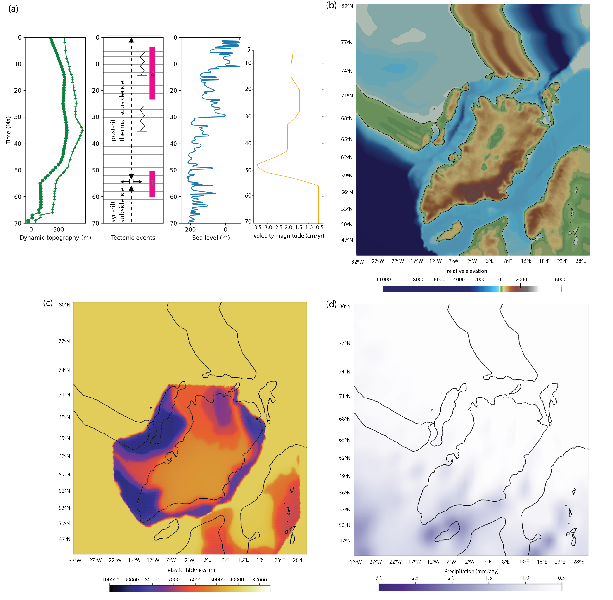

# Norwegian margin 70 Ma

## Description
This model explores the relative contribution of different factors, in particular, the Iceland Plume and onshore tectonic uplift, on sediment dynamics along the Norwegian margin between the Late Cretaceous and Miocene. This simulation includes a Hybrid dynamic topography, combining Barnett-Moore et al. (2017) dynamic topography grid and Skogseid et al. (2014) findings, and Paleogene and Neogene onshore uplift. Horizontal displacements from rift opening and seafloor spreading are also taken into account. The simulation shows that a higher wavelength and amplitude of the Iceland Plume than what is modelled by Barnett-Moore et al. (2017) better reproduces sediment dispersal pattern and sediment thickness along the mid-Norwegian margin. It also demonstrates that 1) the role of dynamic topography is most important during the Late Cretaceous to Paleocene, 2) the influence of onshore tectonic uplift on sedimentation become obvious after 50 Ma and its presence is suggested, 3) flexural adjustment and sea-level fluctuation become an important driver of sedimentation in the region during Eocene and from Oligocene to Miocene respectively.

###### Keywords: `Norwegian margin, Iceland Plume, sediment dispersal, tectonic evolution`

## Objective
The aim of this project is to investigate the effects of different uplift scenarios and dynamic topography models on sediment flux and stratal structure to better understand the influence of the tectonic evolution on the sedimentation history in the region. Comprehensive numerical landscape evolution models, incorporating tectonic and climatic factors, are run with varying dynamic topography models and onshore tectonic uplift scenarios. The resulted sedimentation signals are separated from other factors and evaluated.

This project also aims to give an estimation of sedimentation in the mid-Norwegian rift basin and link pulses of sediment flux with different denudation events to better understand the role of climatic and tectonic forcings through time.

## Software
### Badlands
Badlands (https://badlands.readthedocs.io/) is a landscape evolution numerical modelling code developed within the EarthByte Group, School of Geoscience, The University of Sydney.

## What data are made available?
- input parameters (including dynamic topography grids, initial topography etc...)
- Badlands script
- visualization of models (including wheeler diagrams, movie of model evolution etc...)

## Model setup:

The initial topography is approximated by subtracting horizontal and vertical displacements (including dynamic topography and tectonics) from the present-day topography. The Miller et al. (2005) short term sea-level curve with a Cretaceous section from Haq (2014) is applied to the simulation. Lithospheric flexure is also taken into account. A) the present-day topography, B) the paleo-topography at 70 Ma, C) present-day precipitation rates and D) the timing of plume impingement and amplitude of dynamic topography experienced in the Norwegian continental and passive margins of the Barnett-Moore et al. (2017) dynamic topography and the Hybrid dynamic topography.

## Model conditions:

Values applied for various Badlands modules.
