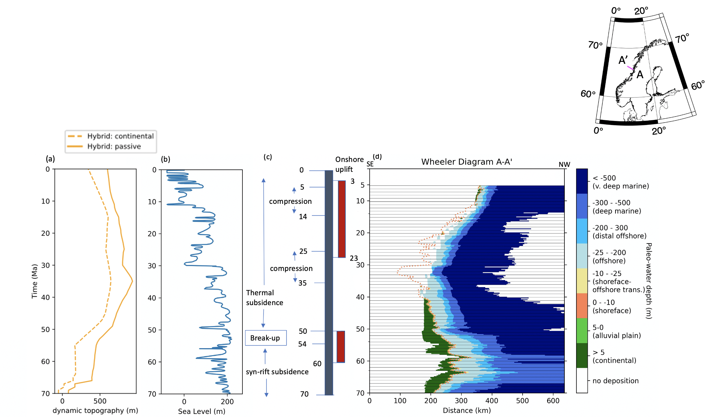
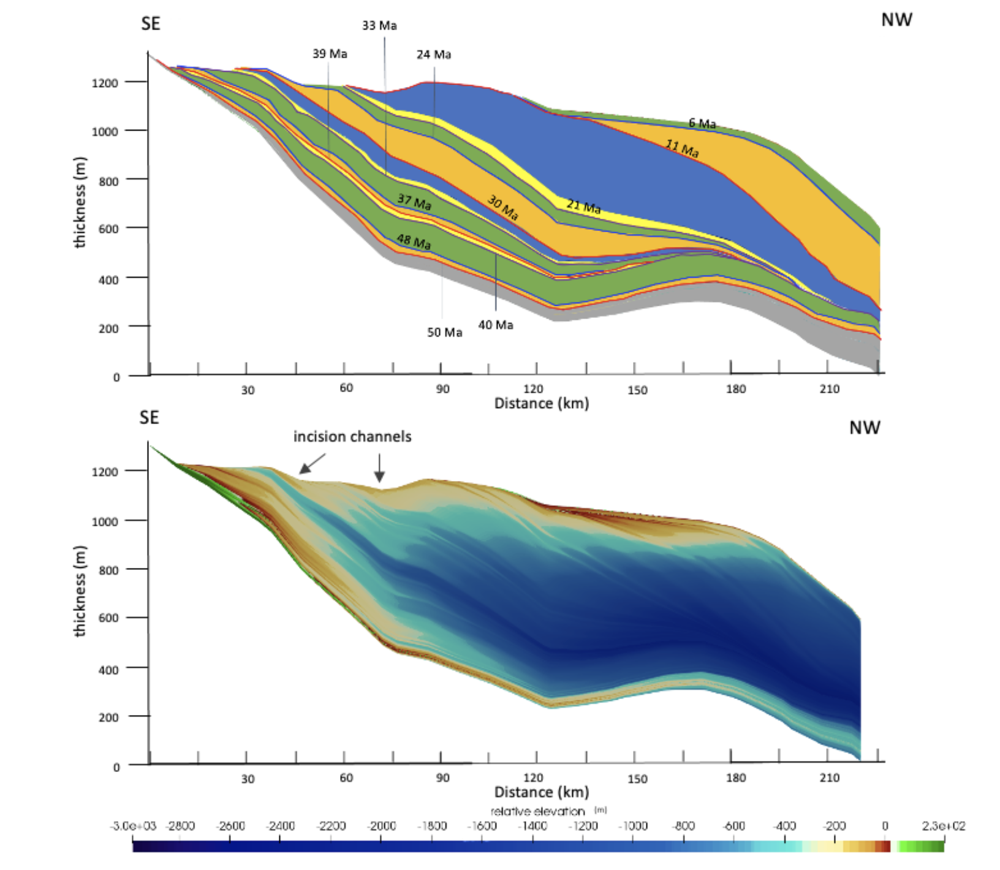

# Animation:
<video src="out_visual/topo_erodep_movie.mp4" width="800" height="500"/>

  This model explores the relative contribution of different factors, in particular, the Iceland Plume and onshore tectonic uplift, on sediment dynamics along the Norwegian margin between the Late Cretaceous and Miocene. This simulation includes a Hybrid dynamic topography, combining Barnett-Moore et al. (2017) dynamic topography grid and Skogseid et al. (2014) findings, and Paleogene and Neogene onshore uplift. Horizontal displacements from rift opening and seafloor spreading are also taken into account. The simulation shows that a higher wavelength and amplitude of the Iceland Plume than what is modelled by Barnett-Moore et al. (2017) better reproduces sediment dispersal pattern and sediment thickness along the mid-Norwegian margin. It also demonstrates that 1) the role of dynamic topography is most important during the Late Cretaceous to Paleocene, 2) the influence of onshore tectonic uplift on sedimentation become obvious after 50 Ma and its presence is suggested, 3) flexural adjustment and sea-level fluctuation become an important driver of sedimentation in the region during Eocene and from Oligocene to Miocene respectively.

# Parameters:
| Parameters        | Values    |
| ------------- |:-------------:|
| Dynamic topography     | Hybrid |
| Sea level (SL)     | Short term SL curve |
| Onshore tectonics | two phases      |

# Result:

(Top) shows cross-section along the A-A’ cross-section.
(Bottom) shows the evolution of stratal sequences along the mid-Norwegian margin (i.e. along the A-A’ cross-section), in particular between 70 and 56 Ma. b) Dynamic topography at continental and passive margins, c) sea-level variations and d) tectonic uplift and subsidence responsible for the depositional system on the Norway mid-margin. e) The wheeler diagram along the cross-section A-A’ of the model incorporating modified Miller et al. (2005) sea-level, the Hybrid dynamic topography and two phases of onshore uplift (model H2q). The orange dotted line indicates the shoreline trajectory. The stratal sequence is recorded in 1 Myr time intervals. The Wheeler diagram is coloured by paleo-depth that can be used to represent different depositional environments. Given that grain size is determined by depositional environments, facies successions can be derived. Corresponding stratal sequence and key surfaces (SB: sequence boundaries; MRS: maximum regressive surfaces; MFS: maximum flooding surfaces) are also represented. Line graphs showing dynamic topography tested in this study (left) and the modified Miller et al. (2005) short term sea-level curve (middle).
